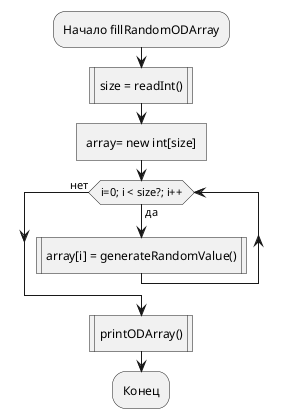

# fillRandomODArray

```plantuml
@startuml
:Начало fillRandomODArray;
:size = readInt(); <<procedure>> 
:array= new int[size]; <<task>> 
while (i=0; i < size?; i++) is (да)
  :array[i] = generateRandomValue(); <<procedure>> 
endwhile (нет)
:printODArray(); <<procedure>> 
:Конец;
@enduml
```