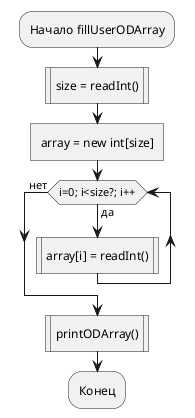
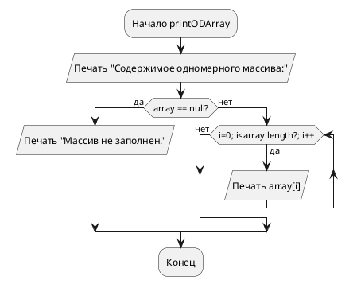
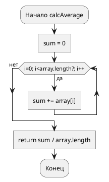
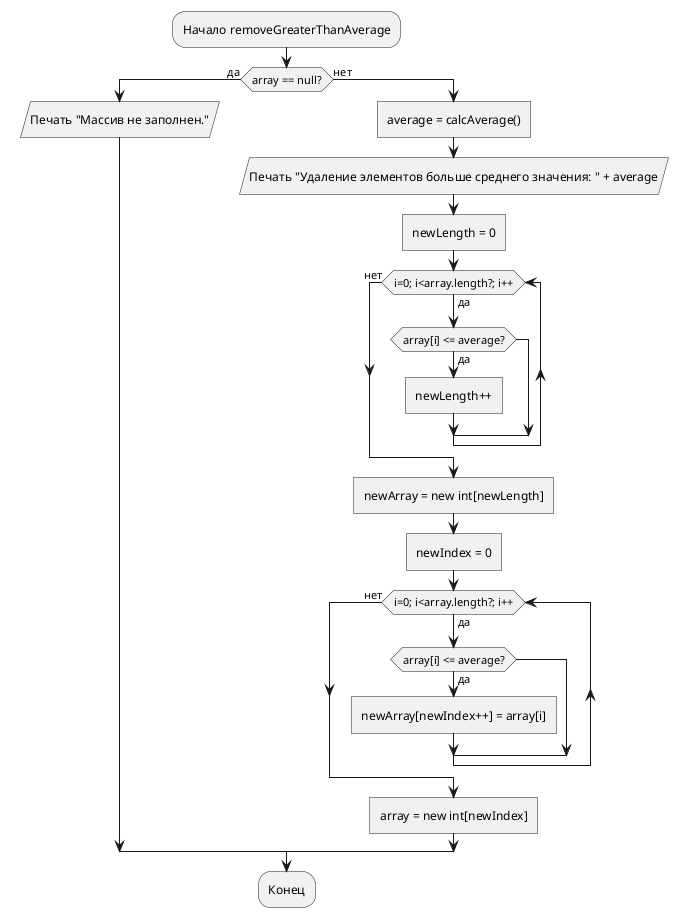
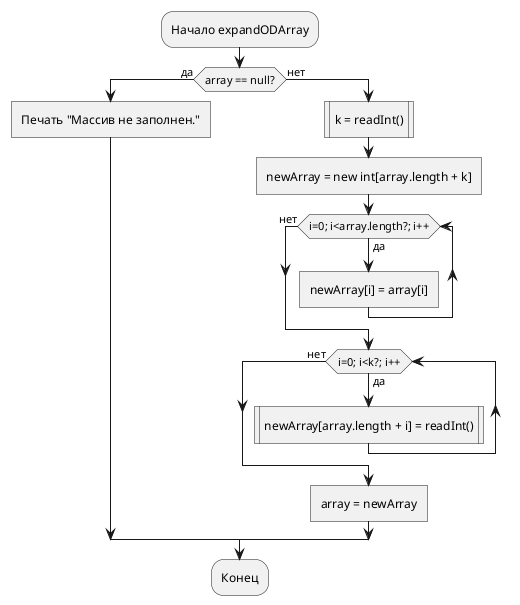
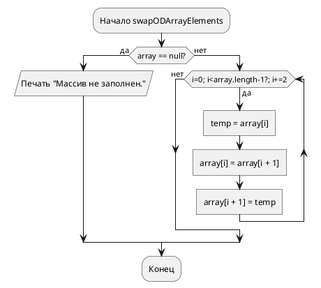
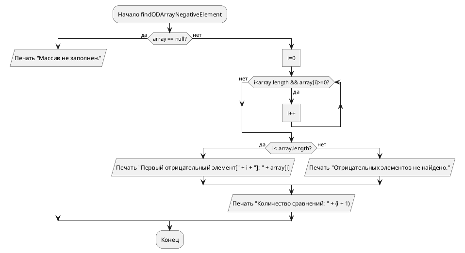

# fillRandomODArray

```plantuml
@startuml
skinparam ConditionEndStyle hline
:Начало fillRandomODArray;
:size = readInt(); <<procedure>>
:array = new int[size]; <<task>>
while (i=0; i<size?; i++) is (да)
  :array[i] = generateRandomValue(); <<procedure>>
endwhile (нет)
:printODArray(); <<procedure>>
:Конец;
@enduml
```

# fillUserODArray

```plantuml
@startuml
skinparam ConditionEndStyle hline
:Начало fillUserODArray;
:size = readInt(); <<procedure>>
:array = new int[size]; <<task>>
while (i=0; i<size?; i++) is (да)
  :array[i] = readInt(); <<procedure>>
endwhile (нет)
:printODArray(); <<procedure>>
:Конец;
@enduml
```

# printODArray

```plantuml
@startuml
skinparam ConditionEndStyle hline
:Начало printODArray;
:Печать "Содержимое одномерного массива:"; <<save>>
if (array == null?) then (да)
  :Печать "Массив не заполнен."; <<save>>
else (нет)
  while (i=0; i<array.length?; i++) is (да)
    :Печать array[i]; <<save>>
  endwhile (нет)
endif
:Конец;
@enduml
```

# calcAverage

```plantuml
@startuml
skinparam ConditionEndStyle hline
:Начало calcAverage;
:sum = 0; <<task>>
while (i=0; i<array.length?; i++) is (да)
  :sum += array[i]; <<task>>
endwhile (нет)
:return sum / array.length; <<task>>
:Конец;
@enduml
```

# removeGreaterThanAverage

```plantuml
@startuml
skinparam ConditionEndStyle hline
:Начало removeGreaterThanAverage;
if (array == null?) then (да)
  :Печать "Массив не заполнен."; <<save>>
else (нет)
  :average = calcAverage(); <<task>>
  :Печать "Удаление элементов больше среднего значения: " + average; <<save>>
  :newLength = 0; <<task>>
  while (i=0; i<array.length?; i++) is (да)
    if (array[i] <= average?) then (да)
      :newLength++; <<task>>
    endif
  endwhile (нет)
  :newArray = new int[newLength]; <<task>>
  :newIndex = 0; <<task>>
  while (i=0; i<array.length?; i++) is (да)
    if (array[i] <= average?) then (да)
      :newArray[newIndex++] = array[i]; <<task>>
    endif
  endwhile (нет)
  :array = new int[newIndex]; <<task>>
endif
:Конец;
@enduml
```

# expandODArray

```plantuml
@startuml
skinparam ConditionEndStyle hline
:Начало expandODArray;
if (array == null?) then (да)
  :Печать "Массив не заполнен."; <<task>>
else (нет)
  :k = readInt(); <<procedure>>
  :newArray = new int[array.length + k]; <<task>>
  while (i=0; i<array.length?; i++) is (да)
    :newArray[i] = array[i]; <<task>>
  endwhile (нет)  
  while (i=0; i<k?; i++) is (да)
    :newArray[array.length + i] = readInt(); <<procedure>>
  endwhile (нет)
  :array = newArray; <<task>>
endif
:Конец;
@enduml
```

# swapODArrayElements

```plantuml
@startuml
skinparam ConditionEndStyle hline
:Начало swapODArrayElements;
if (array == null?) then (да)
  :Печать "Массив не заполнен."; <<save>>
else (нет)
  while (i=0; i<array.length-1?; i+=2) is (да)
    :temp = array[i]; <<task>>
    :array[i] = array[i + 1]; <<task>>
    :array[i + 1] = temp; <<task>>    
  endwhile (нет)
endif
:Конец;
@enduml
```

# findODArrayNegativeElement

```plantuml
@startuml
skinparam ConditionEndStyle hline
:Начало findODArrayNegativeElement;
if (array == null?) then (да)
  :Печать "Массив не заполнен."; <<save>>
else (нет)
  :i=0; <<task>>    
  while (i<array.length && array[i]>=0?) is (да)
    :i++; <<task>>
  endwhile (нет)
  if (i < array.length?) then (да)
    :Печать "Первый отрицательный элемент[" + i + "]: " + array[i]; <<save>>
  else (нет)
    :Печать "Отрицательных элементов не найдено."; <<save>>
  endif
  :Печать "Количество сравнений: " + (i + 1); <<save>>
endif
:Конец;
@enduml
```
